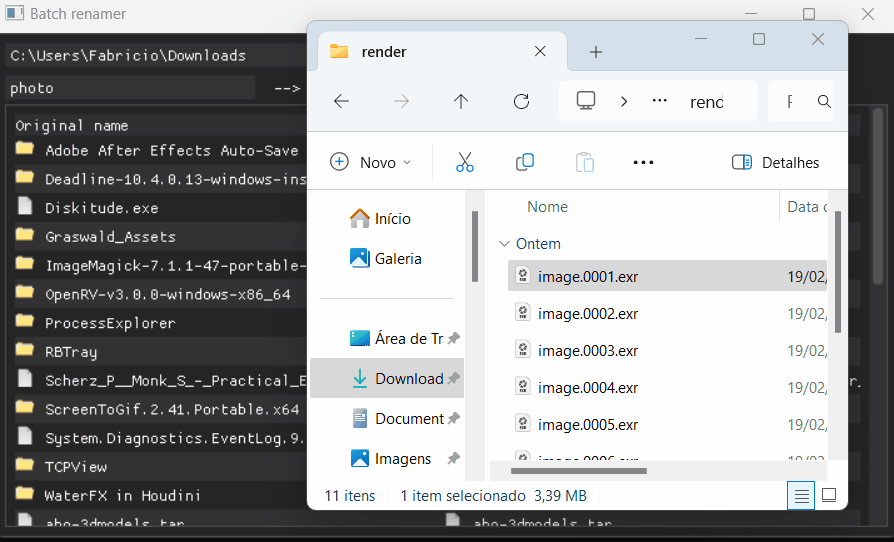

## Batch file renamer

Rename multiple files by simple string replacement, with a live preview of changes to be applied.

Note: Uses [DearPyGui_Extend](https://github.com/fabriciochamon/DearPyGui_Extend) for the filebrowser.

