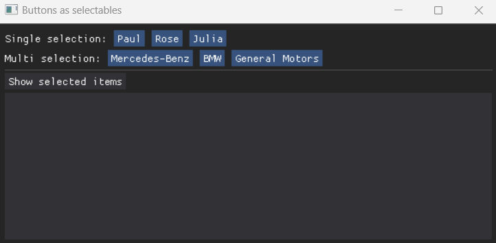

## Buttons as selectables

Creates button groups with single/multi selection properties. 

The buttons can store any data (a dict with some item settings, for example), and are accessible through a global variable from selectables.py

