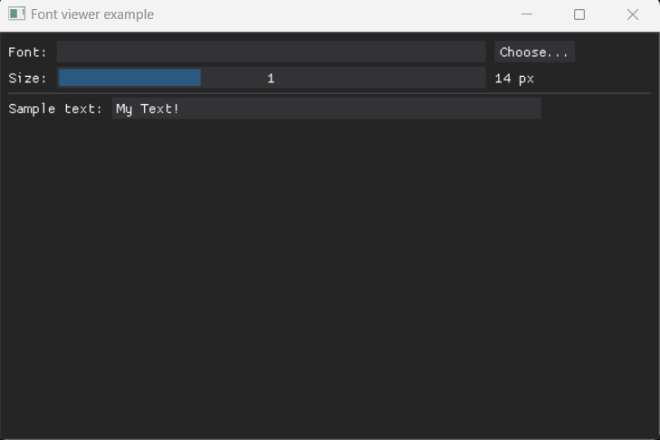

## Batch file renamer

Rename multiple files by simple string replacement.

Note: Uses [DearPyGui_Extend](https://github.com/fabriciochamon/DearPyGui_Extend) for the filebrowser, but can be changed to dpg built-in to remove dependencies.

